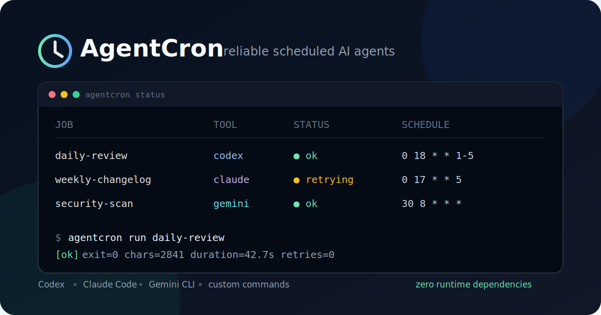

<div align="center">

# AgentCron

### Cron + watchdog for unattended AI coding agents

Run **Codex, Gemini CLI, or any command** on schedule. Detect silent failures, retry safely, kill hung process trees, and inspect every run from one CLI.

[](https://github.com/shkyyy18/cc-autopilot/actions/workflows/ci.yml)
[](https://github.com/shkyyy18/cc-autopilot/releases/latest)
[](https://www.python.org/)
[](LICENSE)
[](pyproject.toml)

**Windows-first · Cross-platform · Local-only · Zero runtime dependencies**

</div>



```text
$ agentcron status
JOB                      TOOL       STATUS         SCHEDULE           LAST RUN
------------------------------------------------------------------------------------------
daily-review             codex      ok             0 18 * * 1-5       2026-07-12T18:02:41+08:00
weekly-changelog         gemini     silent-fail    0 17 * * 5         2026-07-11T17:00:09+08:00
```

## Why AgentCron?

A scheduler can tell you that a process started. It cannot tell you whether your AI agent did useful work.

Unattended agent jobs fail differently from ordinary scripts:

- the CLI exits successfully but returns an empty or tiny response;
- a tool call hangs and leaves child processes behind;
- Windows Task Scheduler runs with a different PATH or encoding;
- a visible console window gets closed by accident;
- failures remain invisible until someone checks the result.

AgentCron is the small reliability layer between your scheduler and your coding agent.

## 30-second quick start

```powershell
# Install directly from GitHub
python -m pip install "git+https://github.com/shkyyy18/cc-autopilot.git"

# In any repository
agentcron init
agentcron add daily-review --tool codex --prompt prompts/daily-review.md --cron "0 18 * * 1-5"

# Edit the generated prompt, then test and schedule it
agentcron run daily-review
agentcron install daily-review
agentcron status
```

Use `--tool gemini` or `--tool custom --command "your command"` for another runner.

## Choose a proven workflow

| Goal | Start here | Proof of success |
|---|---|---|
| Run a daily repository review on Windows | [Windows recipe](docs/recipes.md#recipe-1-daily-repository-review-on-windows) | Manual run is `ok`, then the scheduled entry appears in Task Scheduler |
| Generate a weekly changelog on Linux/macOS | [cron recipe](docs/recipes.md#recipe-2-weekly-changelog-on-linux-or-macos) | Dry-run command is correct and a local run produces a readable log |
| Feed health into another script or dashboard | [JSON health recipe](docs/recipes.md#recipe-3-monitor-health-from-another-script) | `status --json` is parseable and returns non-zero for unhealthy jobs |
| Use another local runner | [custom command recipe](docs/recipes.md#recipe-4-run-a-non-codex-command) | The explicit command runs with bounded timeout and local logging |

The [ten-minute evaluation checklist](docs/recipes.md#ten-minute-evaluation-checklist) is the fastest way to decide whether AgentCron fits your environment.

## What you get

| Capability | Raw cron / Task Scheduler | AgentCron |
|---|:---:|:---:|
| Start a process on schedule | Yes | Yes |
| Codex, Gemini, custom commands | Manual | Built in |
| UTF-8 prompt and output handling | Manual | Yes |
| Timeout with process-tree cleanup | Manual | Yes |
| Detect exit-0-but-empty responses | No | Yes |
| Bounded automatic retries | Manual | Yes |
| Structured run logs | No | Yes |
| One health view for every job | No | Yes |
| Local-only; no hosted control plane | Yes | Yes |

## Configuration

`agentcron init` creates `agentcron.json`:

```json
{
  "version": 1,
  "defaults": {
    "timeout_minutes": 30,
    "min_output_chars": 80,
    "retries": 1
  },
  "jobs": [
    {
      "id": "daily-review",
      "tool": "codex",
      "prompt": "prompts/daily-review.md",
      "cwd": ".",
      "cron": "0 18 * * 1-5"
    }
  ]
}
```

Each job may override `timeout_minutes`, `min_output_chars`, `retries`, `log_dir`, `env`, or `command`.

### Failure notifications

Optionally configure a webhook that receives a POST when a job ends in `failed`, `timeout`, or `silent-fail`:

```json
{
  "id": "weekly-changelog",
  "tool": "codex",
  "prompt": "prompts/changelog.md",
  "cron": "0 17 * * 5",
  "notify": {
    "webhook_url": "https://hooks.example.com/agentcron"
  }
}
```

By default, the payload includes only metadata (job id, tool, status, exit code, output character count, duration, attempt number, and timestamps). The full agent output and prompt are never sent unless you explicitly opt in:

```json
"notify": {
  "webhook_url": "https://hooks.example.com/agentcron",
  "include_output": true,
  "include_prompt": true,
  "timeout": 10
}
```

Notification failures are silently ignored and never affect the job exit status.

### Runner defaults

| Tool | Default invocation |
|---|---|
| Codex | `codex exec -` |
| Gemini CLI | `gemini -p` |
| Custom | Your explicit `command` |

Commands are configurable because agent CLIs evolve. If your installed version uses different flags, set a command list in the job:

```json
{
  "id": "review",
  "tool": "custom",
  "command": ["my-agent", "run", "--stdin"],
  "prompt": "prompts/review.md",
  "cron": "0 9 * * *"
}
```

## CLI

```text
agentcron init [--force]                       Create a project config
agentcron add ID --tool TOOL --prompt FILE     Add a job and prompt template
agentcron run ID                               Run now with retries and logging
agentcron status [--json]                      Inspect latest health
agentcron doctor                               Check config, tools, and scheduler
agentcron install ID... [--all] [--dry-run]   Install scheduler entries
```

Use a config outside the current directory with `--config PATH` or `AGENTCRON_CONFIG`.

### Machine-readable health

`agentcron status --json` emits a versioned, privacy-safe document for scripts and monitoring tools:

```json
{
  "schema_version": 1,
  "jobs": [
    {
      "id": "daily-review",
      "tool": "codex",
      "status": "ok",
      "schedule": "0 18 * * 1-5",
      "last_run": "2026-07-14T00:02:41+08:00"
    }
  ]
}
```

The JSON never includes prompt text, command output, command arguments, environment variables, or webhook credentials. The command exits non-zero when any job is `failed`, `timeout`, or `silent-fail`, so it can be used directly in health checks.

## Failure model

Every attempt ends in one explicit state:

- `ok` - exit code 0 and output meets the configured minimum;
- `silent-fail` - exit code 0 but output is suspiciously short;
- `failed` - non-zero exit code or launch failure;
- `timeout` - deadline exceeded; the process tree was terminated;

Logs are stored as `logs/<job>-<timestamp>.log`. Each contains readable agent output plus machine-readable JSON event lines. Prompts, logs, configs, and credentials are ignored by Git by default.

## Scheduling support

- **Windows 10/11:** installs daily and weekly fixed-time jobs into Task Scheduler via `schtasks`.
- **Linux/macOS:** installs standard five-field expressions into the user's `crontab`.
- Run `agentcron install --all --dry-run` before installation to inspect generated commands.

The Python CLI is the supported interface. Use explicit custom commands when a tool needs non-default flags.

## Safety

AgentCron runs the configured command with your current user permissions. It does not sandbox the agent. Review prompts, use least-privilege agent settings, and never commit secrets or private logs. See [SECURITY.md](SECURITY.md).

## Development

```powershell
git clone https://github.com/shkyyy18/cc-autopilot.git
cd cc-autopilot
python -m pip install -e .
python -m unittest discover -s tests -v
```

See [operating recipes](docs/recipes.md), [architecture](docs/architecture.md), [roadmap](ROADMAP.md), [changelog](CHANGELOG.md), [first outside contribution case study](docs/first-contribution-case-study.md), and the [contributing guide](CONTRIBUTING.md).

## Built from real failures

This project grew out of thousands of unattended Windows agent runs: silent 0-token responses, GBK/UTF-8 corruption, orphaned child processes, hidden Task Scheduler failures, and black console windows. The goal is simple: **scheduled agents should be boring to operate.**

## Contributing

Small, focused contributions are welcome. Browse the [open good-first-issue queue](https://github.com/shkyyy18/cc-autopilot/issues?q=is%3Aissue+is%3Aopen+label%3A%22good+first+issue%22) or start with one of these paths:

- add fixture-backed scheduler behavior for another platform;
- improve `doctor` diagnostics for a real installation failure;
- add a privacy-safe notification adapter;
- add reproducible failure cases and regression tests;
- improve documentation for a supported agent CLI.

Open an issue before adding network services or changing runner security defaults. Fork the repository, work on a focused branch, and open a pull request; direct write access is not required. See [CONTRIBUTING.md](CONTRIBUTING.md).

The v0.3 webhook notification adapter began as the project's first external pull request. Contributors are reviewed through isolated CI and credited in the changelog.

## License

MIT
